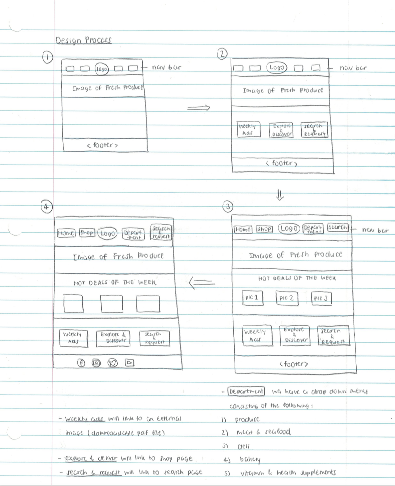
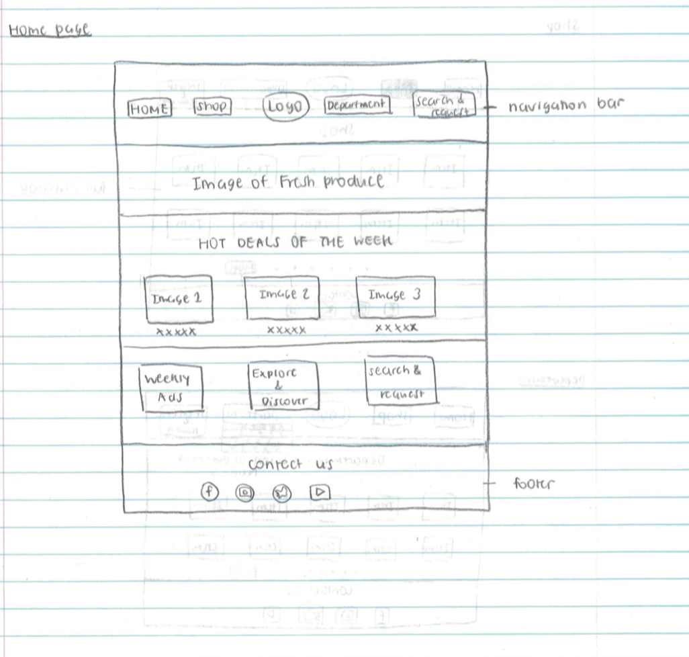
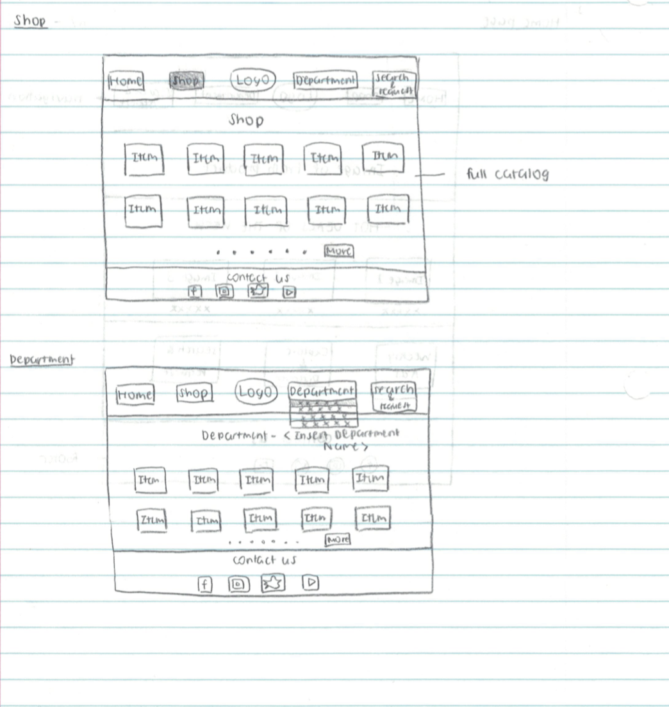
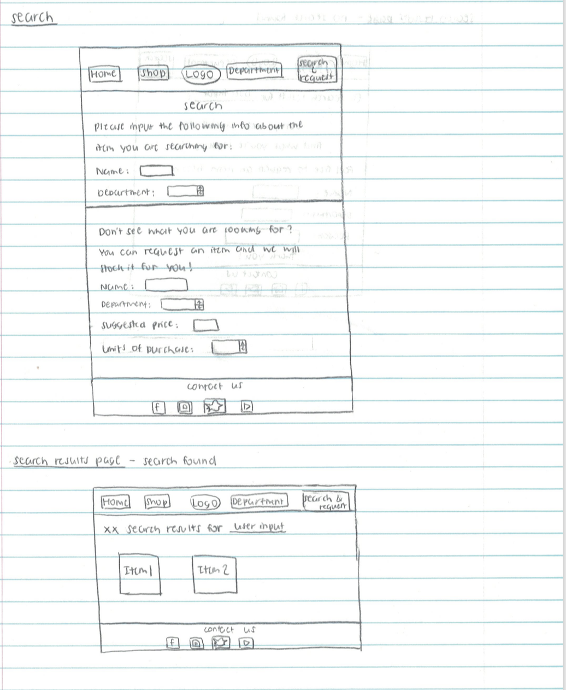
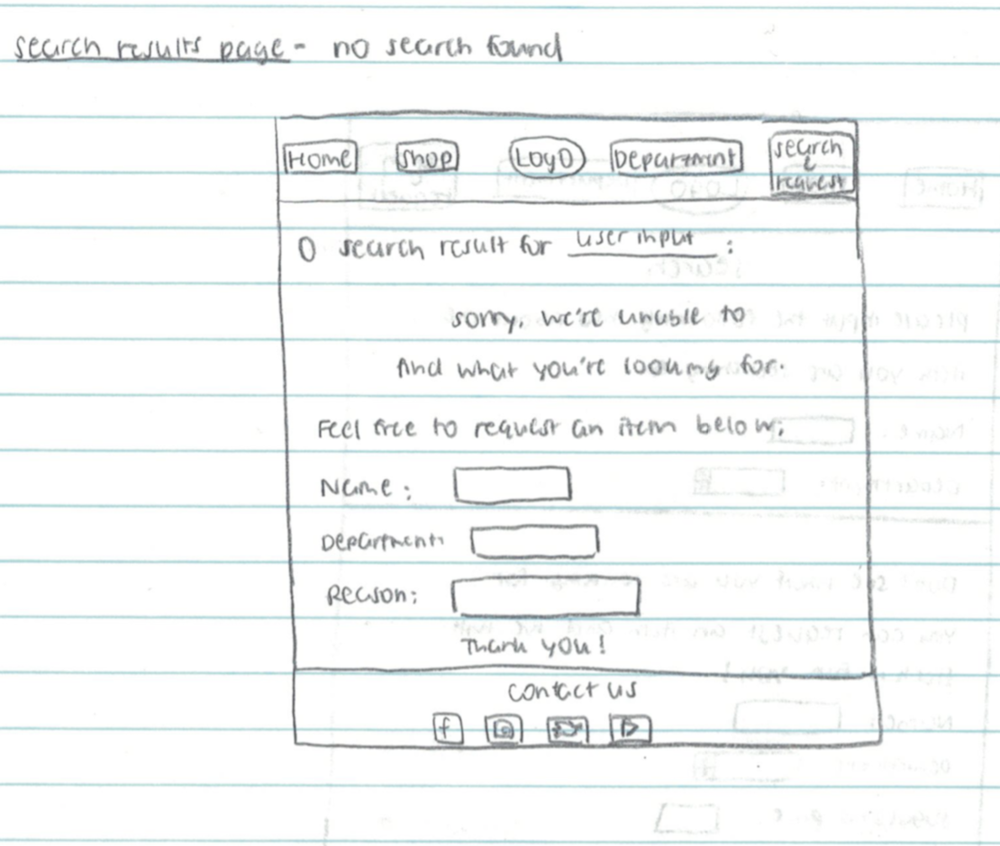

# Project 2: Design Journey

Your Name: [Jane Zhang]

**All images must be visible in Markdown Preview. No credit will be provided for images in your repository that are not properly linked in Markdown. Assume all file paths are case sensitive!**

# Project 2, Milestone 1 - Design, Plan, & Draft Website

## Describe your Catalog

[What will your collection be about? What types of attributes will you keep track of for the *things* in your collection? 1-2 sentences.]

My collection is a catalog for a fictional supermarket named Green Harvest Farmers Market.
The attributes that allow me to keep track of the things in my collection include the following:
1) Item Name
2) Department
3) Price
4) Units in Stock

## Target Audiences

[Tell us about your target audience(s).]

The target audience consists of:
1) health-conscious consumers who are intersted in purchasing fresh produce and other minimally processed, organic products
2) consumers who lead busy lives and therefore have no time for in-store grocery shopping (ex: college students)

## Design Process

[Document your design process. Show us the evolution of your design from your first idea (sketch) to design you wish to implement (sketch). Show us the process you used to organize content and plan the navigation (card sorting).]

[Label all images. All labels must be visible in Markdown Preview.]

The sketches of my design process are as follows:


First, I started out with the design of a homepage with 4 navigatoin tabs: Home, Shop, Department, and Search.

Then, I decided to include a slideshow of images displaying fresh produce below the navigation bar, followed by a "Hot Deals of the Week" displaying items that are on sale.

Underneath "Hot Deals of the Week", I've decided to include three sections as follows:
1) Weekly Ads (links to an external downloadable pdf file that users can access to get a general idea of what items are available in store during that week)
2) Explore & Discover (links to the Shop navigation tab, allowing users to view the full catalog)
3) Search & Request Items (links to the Search navigation tab, allowing users to search for items currently available in store and request those that are not available)

Finally, I decided to incorporate a footer with the supermarket's social media platforms on the bottom of the page.

Content covered in card sorting includes:
-a full catalog
-a search function allowing users to look for a specific item using keywords
-a request function allowing users to request a specific item to be stocked
-a page of products organized by department, allowing users to navigate items more easily
-a "weekly ads" flyer to promote business
-a "hot deals of the week" section to highlight items that are on sale and capture users' attention
-social media platforms that allow users to follow the latest updates and sales
-a recipe page showing users easy-to-make, homemade meals

I ultimately decided to remove the recipe page from consideration since it is not directly relevant to the purpose of the website, which is to allow users to access and purchase fresh produce and other grocery items. The users may have other dishes they want to make in mind and therefore may not necessarily be interested in following the recipes, which defeats the purpose of having it in the first place.


## Final Design Plan

[Include sketches of your final design here.]

The final designs are as follows:







## Templates

[Identify the templates you will use on your site.]

The templates I'm using on my site include a header with 4 navigation tabs as well as a footer displaying the social media platforms of the supermarket.

## Database Schema Design

[Describe the structure of your database. You may use words or a picture. A bulleted list is probably the simplest way to do this. Make sure you include constraints for each field.]

Table: catalog
* field 1: id, INTEGER, PRIMARY KEY, UNIQUE, NOT NULL, AUTO-INCREMENT
* field 2: productname, TEXT
* field 3: department, TEXT
* field 4: unit_price, NUMERIC
* field 5: units_in_stock, INTEGER

## Database Query Plan

[Plan your database queries. You may use natural language, pseudocode, or SQL.]

1. All records
```sql
SELECT *
FROM catalog
```


2. Search records
An example of searching products in the catalog by keyword(user input) is:
```sql
SELECT *
FROM catalog
WHERE productName LIKE '%userinput%'
```

3. Insert record
```sql
INSERT INTO catalog (productname,department,unit_price,units_in_stock)
VALUES(:productName,:department,:unit_price,:units_in_stock)
```

## Code Planning

[Plan any PHP code you'll need here.]

The first function I need is to verify if an item with the user input keyword exists in the catalog.
To do this, I need to first set a varialbe for the sanitized user input, create a query based on the user input, and then return yes/no accorindgly depending on whether there is any corresponding product name that matches the keyword from the user input.

The second function I need is to iterate through the executed SQL query and print out item on each row.

# Final Submission: Complete & Polished Website

## Reflection

[Take this time to reflect on what you learned during this assignment. How have you improved since Project 1? What things did you have trouble with?]
Since Project 1, I have gained a better understanding of how forms work and I have become more comfortable with the process of filtering user input with either the filter_input() or htmlspecialchars() function. I've also learned to implement a drop-down menu for the navigation bar tab as well as using different types of input data for a form such as email, button, submit, etc as opposed to just text. Most importantly, I've learned to sanitize, filter, and escape all user input and output for security reasons to ensure that all collected data is not malicious and will not cause the website to malfunction.

I had trouble with writing SQL queries that corresponds to user request as well as getting the table to display.
